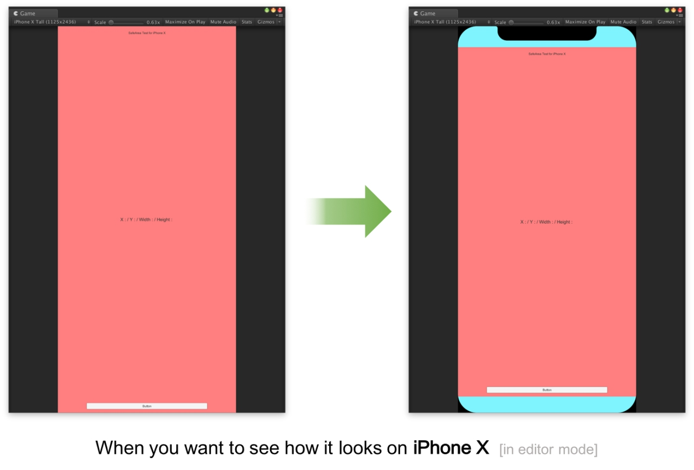
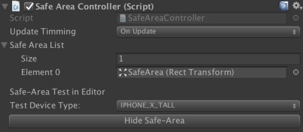
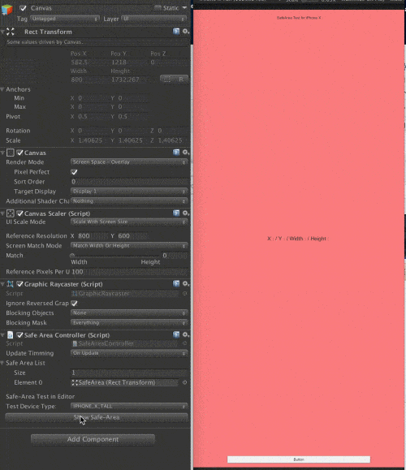

# UnitySafeAreaController
> This plugin allows you to easily check and test the Safe Area for iPhone X in Unity Editor

## Preview

## Key Features
- Easy to support iPhone X
- Fast UGUI-SafeArea testing in editor mode
- Future iPhone UI support is simpler and more scalable

## TODO
- [X] Support iPhone X Auto Safe Area
- [X] Support iPhone X Tall test mode (Frame, Notch)
- [X] Support iPhone X Wide test mode (Frame, Notch)
- [ ] Add homebar UI
- [ ] Refactoring and Class separation
- [X] Add Document

## How to Use

> 1. Add "SafeAreaController.cs" in your root canvas.
> 2. Choose when to set up the SafeArea.
> 3. Put the UGUI bundle that should be in the Safe Area into the List.
> 4. Select the "Test Device Type" and Click "Show Safe-Area".

## Result

## License

The class is licensed under the [MIT License](http://opensource.org/licenses/MIT):

Copyright &copy; 2017 [Sang Hyeon Kim](http://www.github.com/rlatkdgus500).

Permission is hereby granted, free of charge, to any person obtaining a copy of this software and associated documentation files (the "Software"), to deal in the Software without restriction, including without limitation the rights to use, copy, modify, merge, publish, distribute, sublicense, and/or sell copies of the Software, and to permit persons to whom the Software is furnished to do so, subject to the following conditions:

The above copyright notice and this permission notice shall be included in all copies or substantial portions of the Software.
